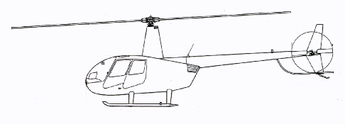

# Ultrasonic Ranging for Model Helicopters

MSc Embedded System and Robotics Dissertation Project

September 2006

## Abstract
Ultrasonic ranging systems that use arrays of conventional time of flight sonar sensors offer an effective, easy to use and low cost means of sensing the distance and direction of objects and surfaces in an environment. Ultrasonic ranging systems are commonly used on many different types of vehicles, however, currently available systems are not suitable for use on small scale model electric helicopters, due to the unique constraints encountered when using this type of aerial vehicle.

An ultrasonic ranging system is therefore developed for use on model helicopters, using an array of SRF10 miniature ultrasonic ranging devices and a novel Real-time Ultrasonic Firing Algorithm for Crosstalk Elimination (RUFACE). The new algorithm is based on the same principles as the existing Error Eliminating Rapid Ultrasonic Firing (EERUF) algorithm but the firing sequences are calculated dynamically in real-time. The RUFACE algorithm is shown to effectively eliminate crosstalk, while the flexibility resulting from the dynamic firing sequences allows for additional benefits such as an adaptive firing rate.

## Full Text
[Dissertation (PDF)](dissertation.pdf)
